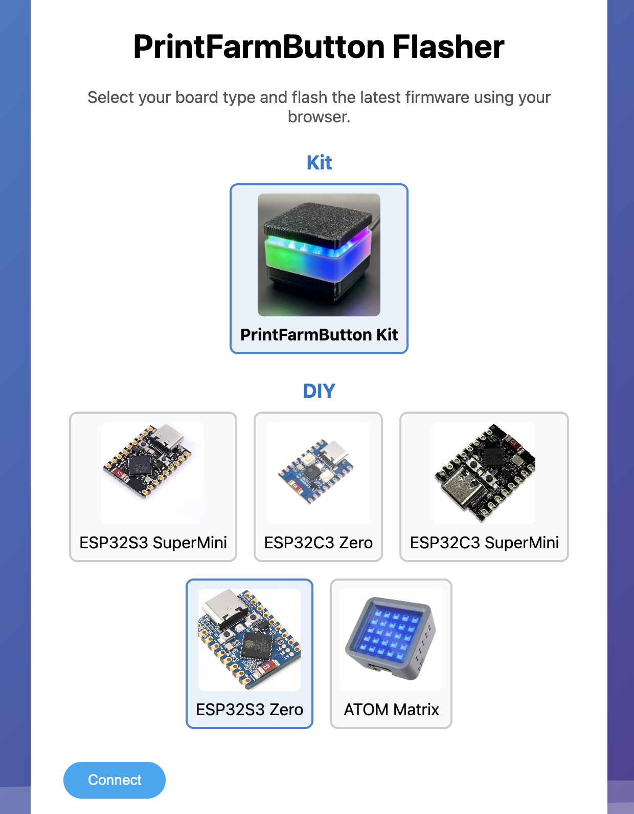
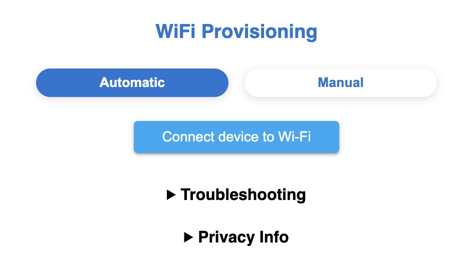

# PrintFarmButton

  

Open Source Button for 3d printer farms

See the state of your prints with a physical LED & microcontroller. With the push of a button you can mark your print plate as clear and ready for the next print in the queue. 

### Printago States:  
🟦 - Idle  
🟨 - Downloading / Starting   
🟪 - Finished / Waiting for bed clear  
🟩 - Printing  
🟥 - Error

## Supported Print Queues

| Print Queue     | Status              |
|-----------------|---------------------|
| printago.io     | ✅ Supported        |
| Bambu LAN       | 🚧 In Progress |
| Simply Print     | 🕵️ Evaluating      |

**Want to support the project?**

Sign up for a free printago.io account using our affiliate code **SPUDER**
Its free forever with ulimited printers. 

## Setup

Web Flashing utility to install printfarm button firmware. 

https://printfarmbutton.com/flash

## Wifi Network

Automate joining the wifi network with the [web wifi configuration tool](https://printfarmbutton.com/)

[https://printfarmbutton.com/](https://printfarmbutton.com/)

You will see a new wifi network named `printfarmbutton-xxxx`. Join the network and navigate to [192.168.4.1](http://192.168.4.1)
Enter your wifi credentials and wait for it to reboot. 

Once you've joined it to your wifi, navigate to `http://printfarmbutton-xxxxxx.local` or find the ip address. 

## Hardware

### Required Components
- ESP32-S3-Zero board
- RGB LED (5v, 144 Leds per meter)
- Physical button connected to GPIO2
- 3D printed enclosure (see `/hardware` folder for STL files)

#### Links

[Esp32-S3-Zero](https://amzn.to/44gplMl)  
[LED Strip](https://amzn.to/44uVFMB)  

### Wiring Diagram

