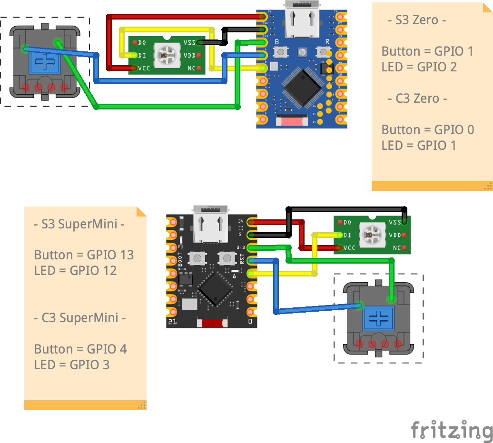

# PrintFarmButton

<p align="center">
  
</p>

Open Source Andon light for 3d printers. 
See the state of your prints with a physical LED & microcontroller. With the push of a button you can mark your print plate as clear and ready for the next print in the queue. 

## Supported Print Queues

| Print Queue     | Status              |
|-----------------|---------------------|
| printago.io     | ✅ Supported        |
| Bambu LAN       | 🚧 In Progress |
| simplyprint     | 🕵️ Evaluating      |
| 3dprinteros     | 🕵️ Evaluating      |


**Support PrintFarmButton:**
Printago is free forever! If you are signing up, please use our affiliate link to help support this project:
[https://www.printago.io?via=spuder](https://www.printago.io?via=spuder)

## Setup

```
cd firmware/esphome
esphome compile config.yaml
esphome upload config.yaml
```

You will see a new wifi network named `printfarmbutton-xxxx`. Join the network and navigate to [192.168.4.1](http://192.168.4.1)
Enter your wifi credentials and wait for it to reboot. 

Once you've joined it to your wifi, navigate to `http://printfarmbutton-xxxxxx.local` or find the ip address. 

## Hardware

### Required Components
- ESP32-S3-Zero board
- RGB LED connected to GPIO1 (5v, 144 Leds per meter)
- Physical button connected to GPIO2
- 3D printed enclosure (see `/hardware` folder for STL files)

#### Links

[Esp32-S3-Zero](https://amzn.to/44gplMl)  
[LED Strip](https://amzn.to/44uVFMB)  

### Wiring
1. Connect the RGB LED:
   - Data pin to GPIO1 on the ESP32-S3-Zero
   - Power pin to 5V
   - Ground pin to GND
2. Connect the physical button between GPIO2 and GND on the ESP32-S3-Zero
   - One terminal of the button connects to GPIO2
   - The other terminal connects to GND
3. Power the ESP32-S3-Zero via USB or an external 5V power supply

### Wiring Diagram




## Firmware

To flash, ensure you have the `esphome` cli installed (`brew install esphome`)

```bash
cd firmware/esphome
make s3   # For ESP32-S3 boards
make c3   # For ESP32-C3 boards
```

To clean build artifacts:
```bash
make clean
```

You can still use the BOARD_TYPE environment variable and esphome directly if needed:
```bash
export BOARD_TYPE=esp32-c3
esphome run config.yaml --device printfarmbutton-xxxx
```
Or in a single command:
```bash
BOARD_TYPE=esp32-c3 esphome run config.yaml --device printfarmbutton-xxxx
```

## ESPHome Makefile Usage

This project provides a Makefile for building and flashing ESPHome firmware for PrintFarmButton devices. You can use either the system ESPHome or Podman container for builds.

### Usage

- **Build only:**
  - `make build-s3-mini` — Compile firmware for ESP32-S3 SuperMini
  - `make build-c3-mini` — Compile firmware for ESP32-C3 SuperMini
  - `make build-s3-zero` — Compile firmware for ESP32-S3 Zero
  - `make build-c3-zero` — Compile firmware for ESP32-C3 Zero

- **Build and flash (run):**
  - `make run-s3-mini` — Compile and upload firmware to ESP32-S3 SuperMini
  - `make run-c3-mini` — Compile and upload firmware to ESP32-C3 SuperMini
  - `make run-s3-zero` — Compile and upload firmware to ESP32-S3 Zero
  - `make run-c3-zero` — Compile and upload firmware to ESP32-C3 Zero

- **Clean build artifacts:**
  - `make clean` — Remove build and output files

- **Legacy aliases:**
  - `make s3` — Alias for `make run-s3-mini`
  - `make c3` — Alias for `make run-c3-mini`

### Podman Support
You can use Podman to run ESPHome builds in a container. To do so, set the `ESPHOME_MODE` environment variable:

```sh
ESPHOME_MODE=podman make build-s3-mini
```

This will use the Podman container and reuse the PlatformIO cache for faster builds.

### Notes
- You must have [ESPHome](https://esphome.io/) installed and available in your PATH, or use Podman as described above.
- Edit the appropriate YAML files in `firmware/esphome/` to configure your device.
- Output binaries are placed in `firmware/output/`.

---

For more details, see the comments in the Makefile and the ESPHome documentation.